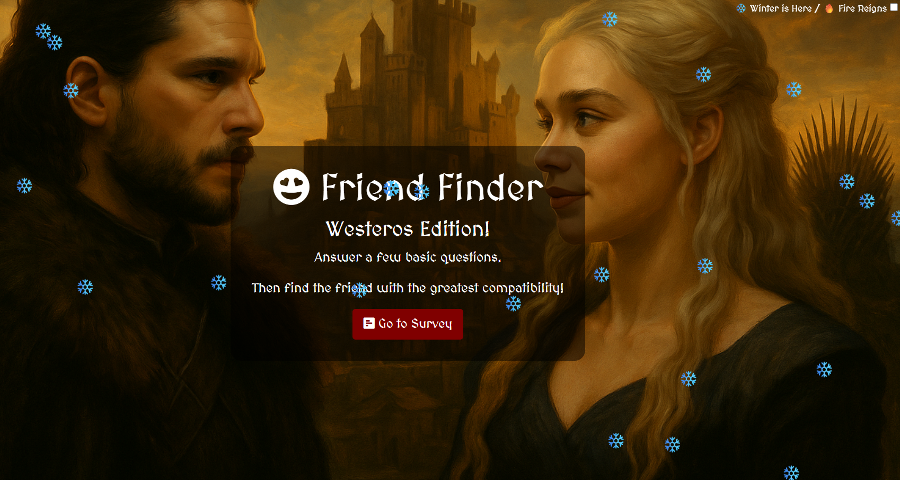
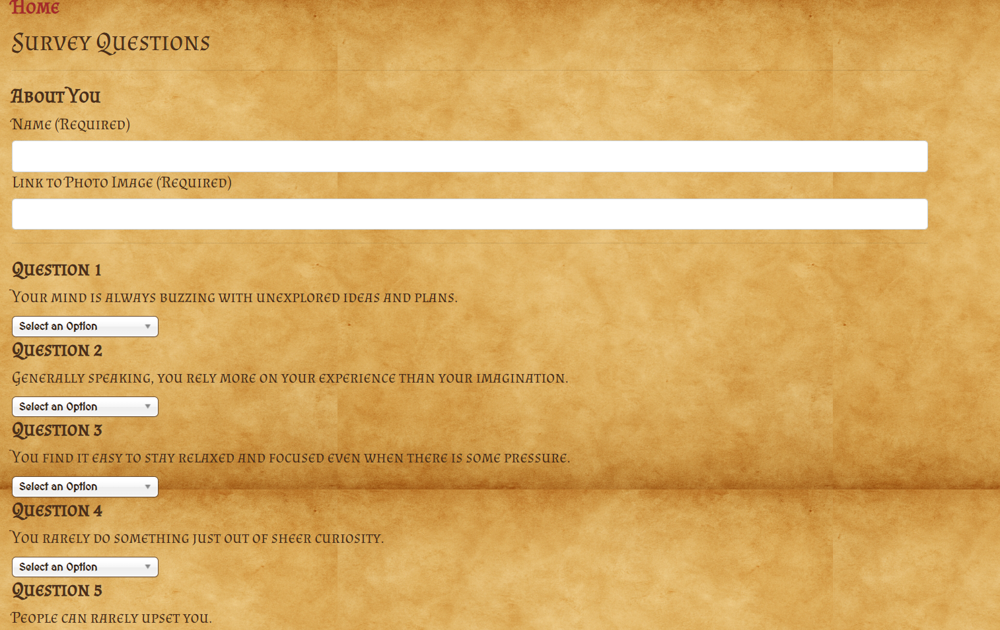
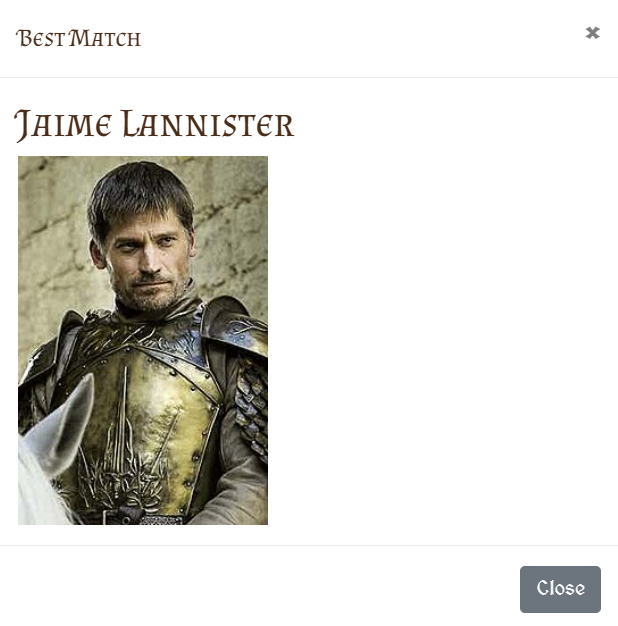

# 🐉 FriendFinder: Westeros Edition

**FriendFinder** is a full-stack, compatibility-based matchmaking app — think dating app meets Game of Thrones.  
Built using **Node.js**, **Express**, **Bootstrap**, and **jQuery**, it pairs users based on survey answers to help them find their most compatible Westerosi soul mate.

---

## 🔗 Live Demo  
👉 [Deployed on Render](https://friendfinder-3166.onrender.com/)

---

## 🧰 Tech Stack

- **Frontend:** HTML5, Bootstrap 4, jQuery, Chosen.js
- **Backend:** Node.js, Express.js
- **Templating:** Handlebars (optional), HTML
- **Deployment:** Render Web Service

---

## ✨ Features

- 📜 10-question compatibility survey
- 🔄 AJAX-powered results display in a modal
- 🎨 Game of Thrones themed UI with dynamic snow/fire toggle
- 📸 Match includes name and image preview
- 📁 Data stored in-memory via local JSON (or optional DB integration)

---

## 🖼 Screenshots

### 🏠 Main page


### 🧪 Survey Page


### 💘 Match Modal

---

## 🚀 Getting Started

### Clone & Install

```bash
git clone https://github.com/yourusername/friendfinder.git
cd friendfinder
npm install
```

### Run Locally

```bash
npm start
```

Then open your browser to: [http://localhost:8080](http://localhost:8080)

---

## 🌐 Project Structure

```
/public            → static assets (CSS, JS, images)
/app/routes        → API and HTML routes
/data/friends.js   → friend data store (JSON)
views/             → optional templates
server.js          → entry point
```

---

## 📝 To-Do / Future Enhancements

- [ ] Add persistent storage (MongoDB or Firebase)
- [ ] Add user authentication
- [ ] Create a mobile-first layout
- [ ] Add fantasy background music + toggle

---

## 🛡 License

MIT © 2025 Anthony Montalto
